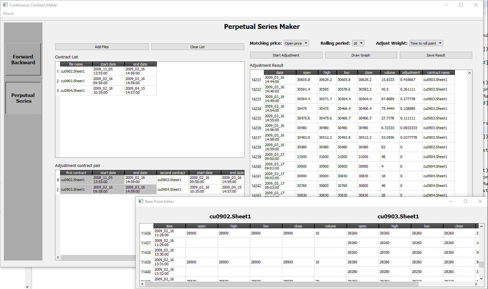

# Continuous Contract Creator #

This program makes continuous contract for quantitative analysis. 

## Purpose ##
Futures contract are short-lived comparing to stock, usually less than a year. 
However, we need longer times series to do quantitative research. 
We should connect different futures contracts to make long continuous times series. 
And one problem lies here: We need continuous contract but two different futures contract has different prices because of contango and backwardation. The price need to be adjusted at the rollover date to avoid the false price jump. 

There are different approaches for price adjustment but charting tools usually provides backward adjustment only. 
Furthermore, there are many combinations of contract choices for connection. 
For example, we can connect January contract with June contract but also we can use January’s and May’s. 
The task gets tiring and tedious. This program is to help doing the task. 
Currently, the program provides forward/backward adjustment and perpetual series adjustment. 

## Screenshot ##

## To do ##

1. Improve connecting contract pair choice algorithm
2. Add proportional adjusment
